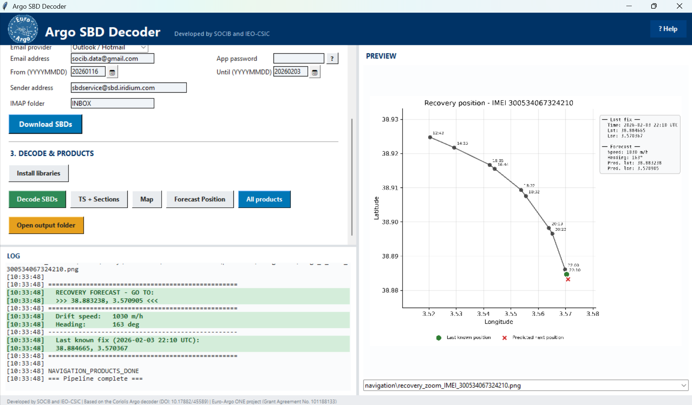

# Argo SBD Decoder

A cross-platform Python application for downloading, decoding and visualizing Iridium SBD data from Argo profiling floats, with a focus on **float recovery support**.

## Main features

- Pure Python SBD decoder covering 87 float types across all major manufacturers
- Download SBD from any IMAP email provider (Gmail, Outlook, Yahoo, iCloud, custom)
- Cross-platform: **Linux, macOS, Windows** (GUI + CLI)
- Generate TS diagrams, temporal sections, trajectory maps and KMZ files
- **Position prediction for float recovery**
  - Recovery zoom map and copy-paste coordinates for vessel operators
  - Float recovery monitoring: internal vacuum, drift speed, heading, range plots

<p align="center">
  
</p>

> **Note:** The decoder covers 87 float types based on the [Coriolis MATLAB decoder](https://doi.org/10.17882/45589). Currently tested and validated with real SBD data for **ARVOR I** and **ARVOR C**. Other float types will be validated as we gain access to their SBD files.

## Supported float families

| Manufacturer | Decoder IDs | Float Type | Frame Format |
|---|---|---|---|
| **NKE** | 201-232 | ARVOR, PROVOR, ARVOR-Deep, ARVOR-C | Binary 100-byte frames |
| **NKE SBD2** | 301-303 | PROVOR Remocean FLBB, ARVOR CM | Binary 140-byte frames |
| **NKE PFV2** | 401-402 | ARVOR PFV2 | SBD fragment reassembly |
| **APEX APF9** | 1001-1016, 1314 | Teledyne/Webb APEX APF9 | Text .msg/.log parsing |
| **APEX APF11** | 1101-1132, 1321-1323 | Teledyne/Webb APEX APF11 | Binary + text logs |
| **NOVA/DOVA** | 2001-2003 | NVS NOVA, DOVA | Variable-length messages |

## Quick start

```bash
# Install dependencies
pip install -r requirements.txt

# Launch the GUI
python app/gui.py

# Or use the CLI (Linux/macOS)
./launch.sh pipeline /path/to/float_folder --decoder_id 233
```

## Position Prediction (Recovery Support)

The forecast position module includes a position prediction that estimates where the float is headed based on its trajectory. The prediction is an extrapolation of the float's trajectory projected onto the plane from the last two GPS fixes (lat/lon coordinates sent via satellite communications). The displacement vector from the previous fix to the current fix is projected forward from the current position. The prediction was implemented in MATLAB by **Gene Massion (MBARI)** for the recovery of a Coastal Profiling Float (CPF), and the code has been translated to Python and adapted to various types of float telemetry data.

### Validation

The prediction was validated using real recovery data from an ARVOR-C float in the Western Mediterranean Sea. Two operational modes were evaluated:

- **EOL (End-of-Life):** The float has finished its mission and remains at the surface, drifting and transmitting GPS fixes every ~2 minutes.
- **Profiling:** The float is still diving (~24 h cycles, depth < 500 m). Predictions are less accurate because subsurface displacement between fixes is not captured.

Position predictions began being transmitted to vessel operators at 07:45 UTC; by 08:20 UTC the float had been recovered.

| Mode | N predictions | Median error | Mean error | Max |
|------|--------------|-------------|------------|-----|
| **EOL** | 10 | **27 m** | 31 m | 66 m |
| **Profiling** | 29 | **263 m** | 345 m | 829 m |

The prediction is most reliable after two consecutive GPS fixes of the same type, as mode transitions mix different drift regimes.

<p align="center">
  
</p>

*Figure: Position prediction validation. (a) EOL map with GPS positions, predictions and errors in metres. (b) Individual errors by navigation point. (c) Error distribution by mode.*

## Installation

Requires **Python 3.8+** (3.10 or later recommended).

```bash
pip install -r requirements.txt
```

On Linux, install `python3-tk` if not present. On macOS, `brew install python-tk` if needed.

## Documentation

- [User Manual](docs/USER_MANUAL.md)
- [Quick Start](docs/QUICK_START.md)
- [Build standalone executables](docs/BUILD.md)

## References

> Rannou Jean-Philippe, Carval Thierry, Fontaine Laure, Bernard Vincent, Coatanoan Christine (2025). Coriolis Argo floats data processing chain. SEANOE. https://doi.org/10.17882/45589

### Contributors

- [@ldiaz-barroso](https://github.com/ldiaz-barroso) (SOCIB)
- [@Alberto-GS](https://github.com/Alberto-GS) (IEO-CSIC)
- [@maucarranza](https://github.com/maucarranza) (SOCIB)

## This software is developed by:

<p align="center">
  <a href="https://www.argoespana.es"></a>
</p>

<p align="center">
  <a href="https://www.socib.es"></a>
  &nbsp;&nbsp;&nbsp;&nbsp;&nbsp;&nbsp;
  <a href="https://ieo.csic.es"></a>
</p>

## Funding

<p align="center">
  <a href="https://www.euro-argo.eu/EU-Projects/Euro-Argo-ONE-2025-2027"></a>
</p>

This software was developed under the Euro-Argo ONE project. This project has received funding from the European Union, Horizon Europe - the Framework Programme for Research and Innovation (2021 to 2027) under Grant Agreement No. 101188133. Call HORIZON-INFRA-2024-DEV-01-03 - Consolidation of the RI landscape - Individual support for evolution, long term sustainability and emerging needs of pan-European research infrastructures.

## License

[MIT License](LICENSE)
