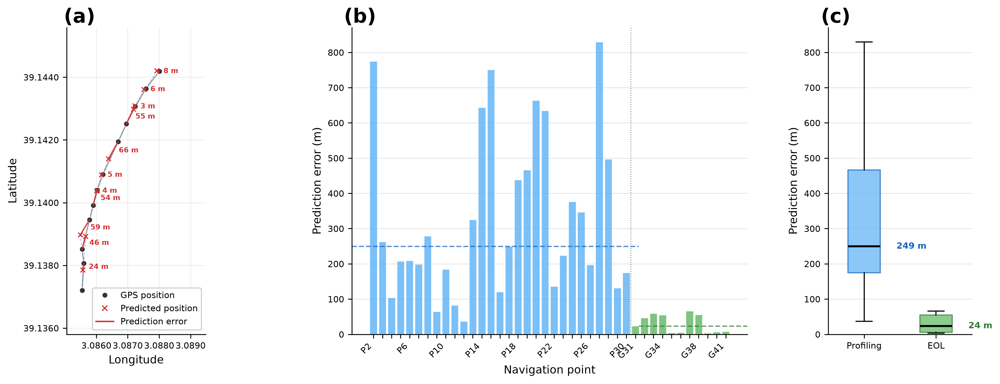
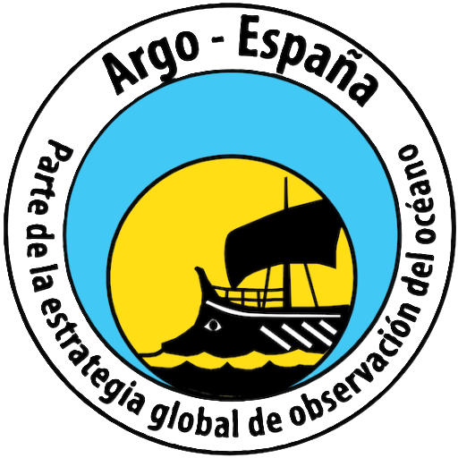
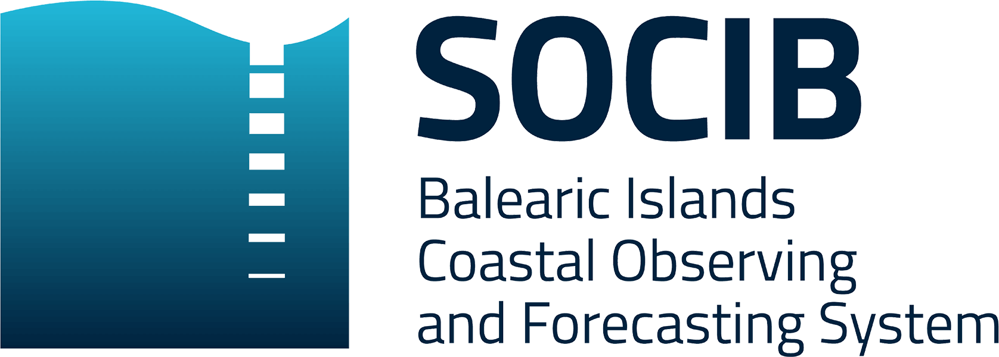
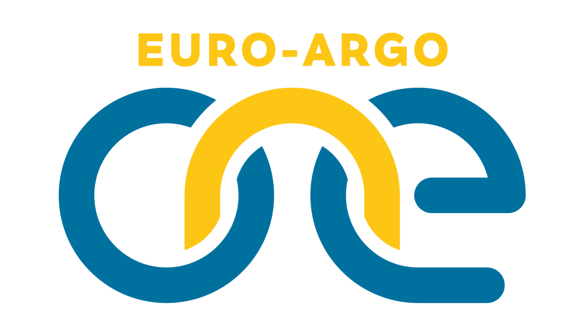

# Argo SBD Decoder

Python application for downloading, decoding, and visualizing Iridium Short Burst Data (SBD) from Argo profiling floats, designed to support float recovery operations and provide rapid access to float data.

## Main features

- Python SBD decoder covering 87 float types from all major float manufacturers
- Downloads SBD from any IMAP email provider (Gmail, Outlook, Yahoo, iCloud, custom)
- Compatible with Linux, macOS, Windows (GUI + CLI)
- Generates quick-look outputs, including:
  - Trajectory maps with optional GEBCO bathymetry.
  - T–S diagrams.
  - Vertical sections (depth vs. time) of sensor data.
  - KMZ files for visualization in Google Earth.
- Navigation module for recovery operations, providing:
  - Heading, drift speed, and geographic coordinates for vessel operators.
  - Float health monitoring plots, including internal vacuum and battery voltage with reference thresholds.
  - KMZ files for visualizing the predicted float position in Google Earth.

> **Note:** The SBD decoder is based on the Coriolis MATLAB decoder (Rannou et al., 2025), covering SBDs from 87 float types. Currently tested and validated with real SBD data for ARVOR I and ARVOR C floats (nke Instrumentation). Other float types will be validated as we gain access to the SBD files.

## Supported float families

| Manufacturer | Decoder IDs | Float Type | Frame Format |
|---|---|---|---|
| NKE | 201-232 | ARVOR, PROVOR, ARVOR-Deep, ARVOR-C | Binary 100-byte frames |
| NKE SBD2 | 301-303 | PROVOR Remocean FLBB, ARVOR CM | Binary 140-byte frames |
| NKE PFV2 | 401-402 | ARVOR PFV2 | SBD fragment reassembly |
| APEX APF9 | 1001-1016, 1314 | Teledyne/Webb APEX APF9 | Text .msg/.log parsing |
| APEX APF11 | 1101-1132, 1321-1323 | Teledyne/Webb APEX APF11 | Binary + text logs |
| NOVA/DOVA | 2001-2003 | NVS NOVA, DOVA | Variable-length messages |

## Installation and quick start

Requires Python 3.8+ (3.10 or later recommended).

```bash
# Install dependencies
pip install -r requirements.txt

# Launch the GUI
python app/gui.py

# Or use the CLI (Linux/macOS)
./launch.sh pipeline /path/to/float_folder --decoder_id 233
```

On Linux, install `python3-tk` if not present. On macOS, `brew install python-tk` if needed.

## Position Prediction (Recovery Support)

The forecast position module includes a position prediction that estimates where the float is headed based on its trajectory. The prediction is an extrapolation of the float's trajectory projected onto the plane from the last two GPS fixes (lat/lon coordinates sent via Iridium satellite communications). The displacement vector from the previous fix to the current fix is projected forward from the last position. The prediction was implemented in MATLAB by Gene Massion (MBARI) for the recovery of a coastal profiling float, and the code has been translated to Python and adapted to various types of float telemetry data.

### Validation

The prediction was tested during the recovery of a coastal profiling float (ARVOR-C) in the Western Mediterranean Sea. Float's heading and position predictions were transmitted to vessel operators at 07:45 UTC; and by 08:20 UTC the float was recovered.

A quantitative validation of the float's trajectory and predictions was performed with telemetry data from two operational modes:

- **Profiling:** The float is still operating in sampling mode (i.e., diving to the seafloor and surfacing every ~24h to gather CTD sensor data on the ascent, transmit data and acquire a GPS fix while at the surface). In sampling mode, predictions are less accurate because subsurface displacement between fixes are not captured.
- **EOL (End-of-Life):** The float has finished its sampling mission and drifts at the surface, transmitting GPS fixes every ~2 minutes.

The prediction is most reliable after two consecutive GPS fixes of the same type, as mode transitions mix different drift regimes.

| Mode | N predictions | Median error | Mean error | Max |
|------|--------------|-------------|------------|-----|
| Profiling | 29 | 263 m | 345 m | 829 m |
| EOL | 10 | 27 m | 31 m | 66 m |

<p align="center">
  
</p>

*Figure: Float's position prediction validation. (a) Float's trajectory in EOL mode with GPS fixes (black dots), predictions and errors (i.e., distance in metres between the prediction and the new surfacing GPS fix, red). (b) Prediction error for each navigation point. (c) Error distribution by operational mode.*

## Documentation

- [User Manual](docs/USER_MANUAL.md)
- [Quick Start](docs/QUICK_START.md)
- [Build standalone executables](BUILD_INSTRUCTIONS.md)

## References

> Rannou Jean-Philippe, Carval Thierry, Fontaine Laure, Bernard Vincent, Coatanoan Christine (2025). Coriolis Argo floats data processing chain. SEANOE. https://doi.org/10.17882/45589

## Contributors

- [@ldiaz-barroso](https://github.com/ldiaz-barroso) (SOCIB)
- [@Alberto-GS](https://github.com/Alberto-GS) (IEO-CSIC)
- [@maucarranza](https://github.com/maucarranza) (SOCIB)

## This software is developed by:

<p align="center">
  <a href="https://www.argoespana.es"></a>
</p>

<p align="center">
  <a href="https://www.socib.es"></a>
  &nbsp;&nbsp;&nbsp;&nbsp;&nbsp;&nbsp;
  <a href="https://ieo.csic.es"></a>
</p>

## Funding

<p align="center">
  <a href="https://www.euro-argo.eu/EU-Projects/Euro-Argo-ONE-2025-2027"></a>
</p>

This software was developed under the Euro-Argo ONE project. This project has received funding from the European Union, Horizon Europe - the Framework Programme for Research and Innovation (2021 to 2027) under Grant Agreement No. 101188133. Call HORIZON-INFRA-2024-DEV-01-03 - Consolidation of the RI landscape - Individual support for evolution, long term sustainability and emerging needs of pan-European research infrastructures.

## License

[MIT License](LICENSE)
